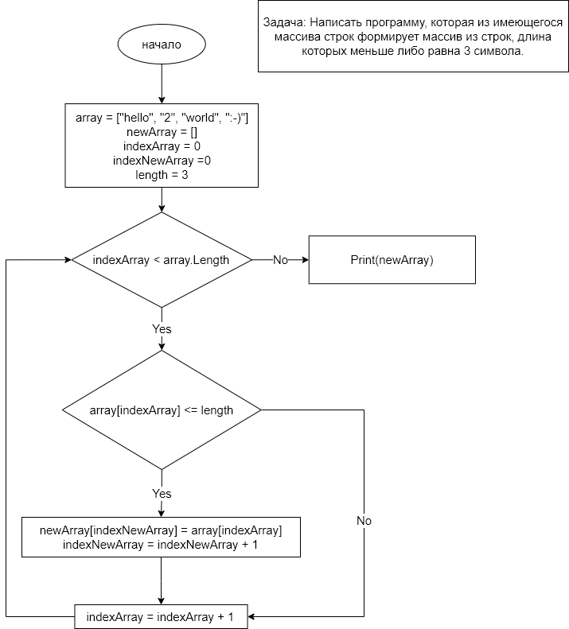

# first_quarter_test
## Репозиторий контрольной работы первой четверти (GB)

## _Условие задачи:_ ##
Написать программу, которая из имеющегося массива строк формирует массив из строк, длина которых меньше либо равна 3 символа. Первоначальный массив можно ввести с клавиатуры, либо задать на старте выполнения алгоритма. При решении не рекомендуется пользоваться коллекциями, лучше обойтись исключительно массивами.

*Например:*

["hello", "2", "world", ":-)"] -> ["2", ":-)"]

["1234", "1567", "-2", "competer science"] -> "-2"]

["Russia", "Denmark", "Kazan"] -> []

## _Блок-схема задачи:_ ##

## _Текстовое описание решения задачи:_ ##
1. Берем первый элемент исходного массива и проверяем длину символов элемента. 
2. Если длина символов элемента меньше или равно 3 символам, то переходим к 3 строке. Если длина символов элемента больше 3 символов переходим к 4 строке
3. Записываем элемент в новый массив
4. Берем следующий элемент исходного массива и проверяем длину символов элемента. Если елементы закончились в исходном массиве то переходим к 7 строке.
5. Если длина символов элемента меньше или равно 3 символам, то переходим к 3 строке. Если длина символов элемента больше 3 символов переходим к 4 строке
6. Записываем элемент в новый массив. И переходим на строку 4
7. Выводим на экран заполненный новый массив